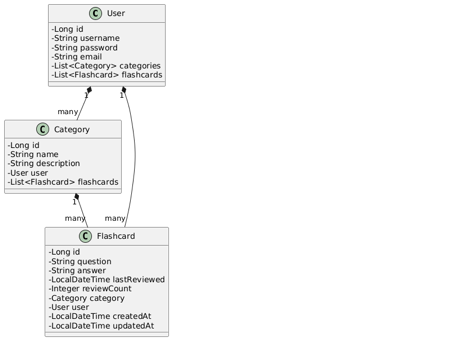
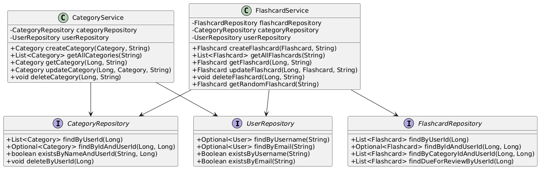

# 🧠 FlashCard — Aprenda com agilidade, revise com inteligência

FlashCard é uma aplicação web desenvolvida com Spring Boot que transforma o processo de aprendizado em uma experiência dinâmica e personalizada. Com foco em flashcards categorizados, o sistema permite que usuários criem, revisem e organizem conteúdos de estudo de forma eficiente — ideal para estudantes, autodidatas e profissionais em constante evolução.

---

## 🚀 Tecnologias Utilizadas

- **Java 21**
- **Spring Boot 3**
- **Spring Data JPA**
- **MySql**
- **JUnit 5 + Mockito**
- **MockMvc (testes de integração)**
- **Jacoco (cobertura de testes)**
- **Lombok**
- **Maven**
- **JWT, BCrypt, Filtros personalizados, Stateless Sessions**
- **DTOs, Exception Handling, Design Patterns (MVC, Service, etc)**
- **Swagger/OpenAPI com SpringDoc**

---

## ✅ Pontos Fortes
- Arquitetura limpa e modular: Separação clara entre controllers, services, repositories e models.

- Segurança com JWT: Implementação sólida de autenticação e autorização.

- Validações com Jakarta Bean Validation: Boa prática para garantir integridade dos dados.

- Swagger/OpenAPI: Excelente para documentação automática da API.

- Tratamento de exceções centralizado: O GlobalExceptionHandler está bem feito e cobre os principais casos.

- Estatísticas e funcionalidades extras: Como duplicar flashcards, marcar como revisado, buscar por categoria.

- Relacionamentos JPA.

- API Rest completa.

- Boas práticas de injeção de dependências.

## 📦 Estrutura do Projeto

```bash
src/
├── main/
│   ├── java/com.flashcard/
│   │   ├── config/
│   │   ├── security/
│   │   ├── controller/
│   │   ├── service/
│   │   ├── model/
|   |   ├── dto/
│   │   ├── repository/
│   │   └── exception/
│   └── resources/
│       └── application.properties
└── test/
    ├── unit/
    └── integration/
```
## Diagramas

### 📈 Diagrama de classe para Models



### Diagrama de Classe para Services e Repositórios


### Diagrama de Classe para Security



### Diagrama de Camadas para Controllers


### Diagrama de Entidade Relacionamentos


## 🧪 Testes e Qualidade
✅ Cobertura de testes acima de 80% com Jacoco

✅ Testes unitários para todos os services

✅ Testes de integração para todos os controllers

✅ Validação de erros e bordas

✅ Simulação de banco com H2

## 🔐 Segurança e Boas Práticas

* Validação de dados com @Valid
* Tratamento global de exceções com @ControllerAdvice
* Filtros personalizados para interceptação de requisições
* Endpoints protegidos por roles e tokens
* Senhas criptografadas com BCrypt
* Separação clara entre camadas (Controller, Service, Repository)
* Uso de DTOs planejado para próxima versão
* Código limpo, legível e com foco em manutenção

## 📚 Funcionalidades

* Criar, listar, atualizar e deletar Flashcards
* Organizar por categorias
* Gerenciar usuários
* Buscar flashcards por categoria
* Pronto para receber autenticação JWT e frontend com React

## 🧠 Por que esse projeto importa?
    “Aprender não é acumular informação. É transformar conhecimento em ação.”
     E é exatamente isso que o FlashCard propõe.

Este projeto foi desenvolvido com foco em boas práticas, testes robustos e arquitetura escalável. Ele representa não só domínio técnico, mas também visão de produto e cuidado com a experiência do usuário.

## 👨‍💻 Sobre o autor
Marcelo Saorim — Engenheiro de Software, pós graduado em Inteligência Artificial e Machine Learning. Desenvolvedor full-stack, apaixonado por código limpo, testes bem feitos e café forte ☕.

Atualmente focado em Java, Spring Boot, Node, Nest, Angular e React, Arquitetura de Microsserviços, Inteligência Artificial, Machine Learning, Deep Learning e Ciências de Dados. Sempre buscando aprender mais e contribuir com soluções que fazem sentido.


- linkedin.com/in/marcelo-rocha-saorim/
- github.com/saorim10

## 🛠️ Como rodar o projeto
```
# Clonar o repositório
git clone https://github.com/seu-usuario/flashlearn.git

# Entrar na pasta
cd flashlearn

# Rodar os testes
mvn test

# Iniciar a aplicação
mvn spring-boot:run
```
## ✨ Próximos passos
- Integração com frontend em Angular
- Dashboard de desempenho do usuário

## 📬 Contato
Se você é recrutador, desenvolvedor ou curioso — fique à vontade para me chamar. Estou sempre aberto a boas conversas, bons projetos e bons desafios.
