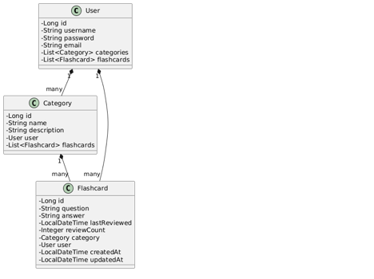
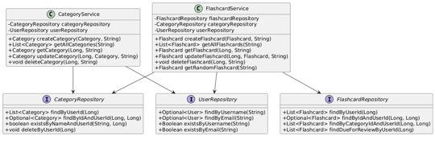
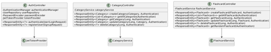
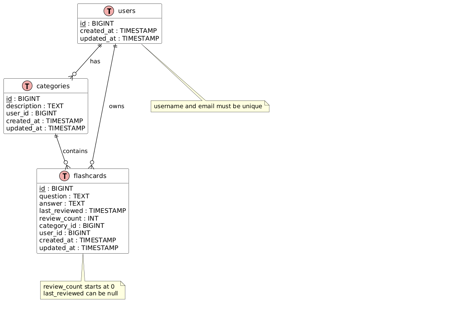

# 🚀 Projeto Flashcard API

Sistema completo de estudo por flashcards, com autenticação segura, categorização inteligente e modos de revisão personalizados. Ideal para quem busca aprender com eficiência e organização.

## 🧠 Funcionalidades Principais

- 🔐 Autenticação de usuários via JWT
- 🔒 Armazenamento seguro de senhas com BCrypt
- 📚 CRUD completo de Flashcards e Categorias
- 🎯 Modo de estudo por categoria ou aleatório
- 📊 Documentação interativa com Swagger
- 🧾 Controle de revisão: contagem e data da última revisão

## 🛠️ Tecnologias Utilizadas

| Camada        | Tecnologias                                                                 |
|---------------|------------------------------------------------------------------------------|
| Backend       | Java 17, Spring Boot, Spring Security, Spring Data JPA                      |
| Banco de Dados| H2 (em memória, ideal para testes e protótipos)                             |
| Segurança     | JWT, BCrypt, Filtros personalizados, Stateless Sessions                     |
| Documentação  | Swagger/OpenAPI com SpringDoc                                               |
| Outros        | Lombok, Maven, DTOs, Exception Handling, Design Patterns (MVC, Service, etc)|

## 🧩 Arquitetura e Design Patterns

- **MVC**: Separação clara entre Model, Controller e Service
- **Repository Pattern**: Abstração do acesso a dados
- **Service Layer**: Lógica de negócio centralizada
- **DTOs**: Segurança e clareza na comunicação entre camadas
- **JWT Strategy**: Autenticação flexível e escalável
- **Clean Code**: Métodos pequenos, nomes semânticos e validações consistentes

## 🔐 Segurança

- Autenticação via JWT com expiração configurável
- Filtros personalizados para interceptação de requisições
- Endpoints protegidos por roles e tokens
- Senhas criptografadas com BCrypt
- CSRF desabilitado para APIs REST

## 📁 Estrutura de Pastas

````
src/ 
└── main/ 
    └── java/ 
        └── com.flashcards/ 
            ├── controller/ 
            ├── model/ 
            ├── repository/ 
            ├── service/ 
            └── security/
````

## Diagramas

### 📈 Diagrama de classe para Models



### Diageama de Classe para Services e Repositórios



### Diageama de Classe para Security


### Diageama de Camadas para Controllers



### Diageama de Entidade Relacionamentos



## 📄 Documentação Swagger

Acesse a documentação interativa em:  
`/swagger-ui.html`  
Explore os endpoints, teste requisições e visualize os modelos de dados.

## 🧪 Testes e Validações

- Validação de entrada via annotations (`@Valid`)
- Tratamento global de exceções com `@ControllerAdvice`
- Mensagens de erro claras e padronizadas

## 🧠 Diferenciais

- Flashcards com controle de revisão (data e contagem)
- Filtros por categoria e seleção aleatória
- Código limpo, modular e escalável
- Pronto para deploy e integração com frontend

## 👨‍💻 Autor

**Marcelo Saorim**  
Engenheiro de Software | Especialista em IA e Machine Learning  
📍 Santa Catarina, Brasil  
🗓️ Agosto de 2025

---

